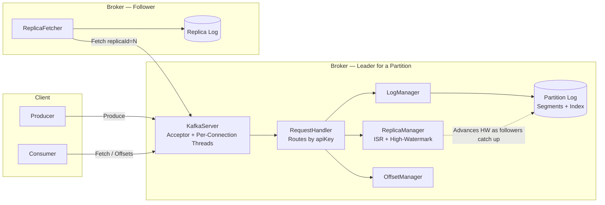
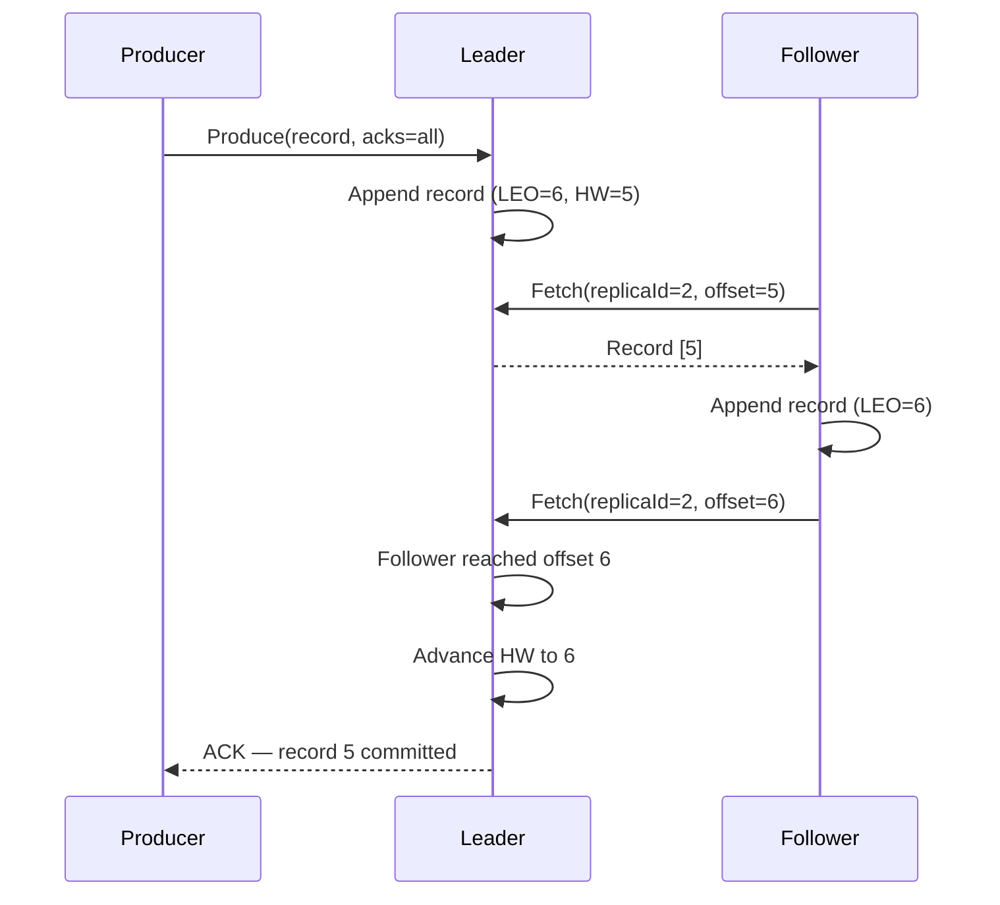
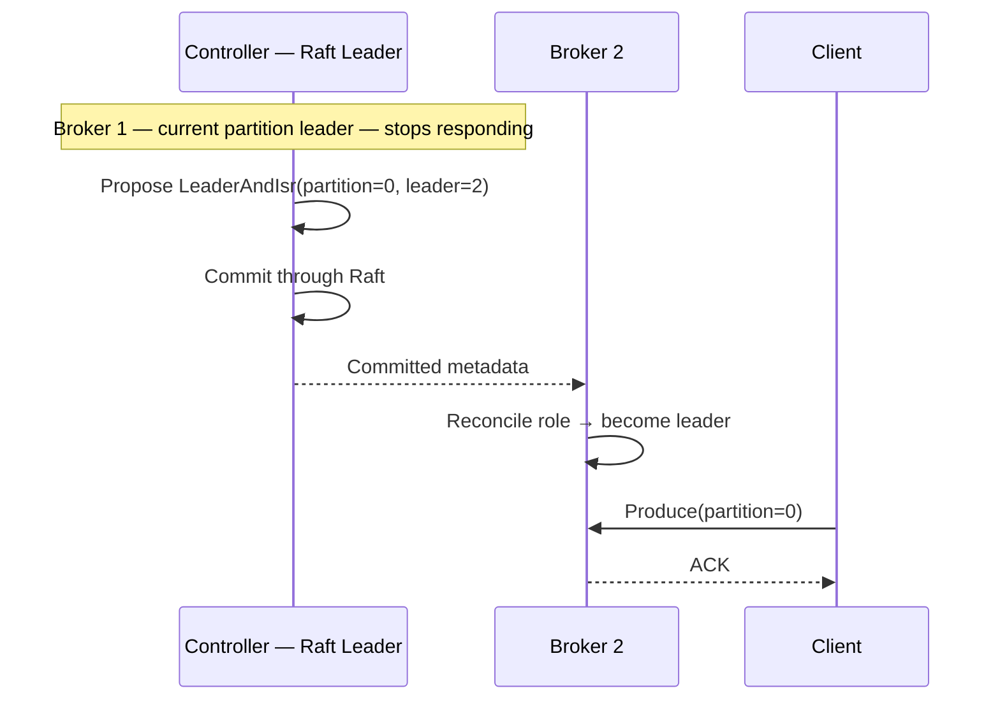
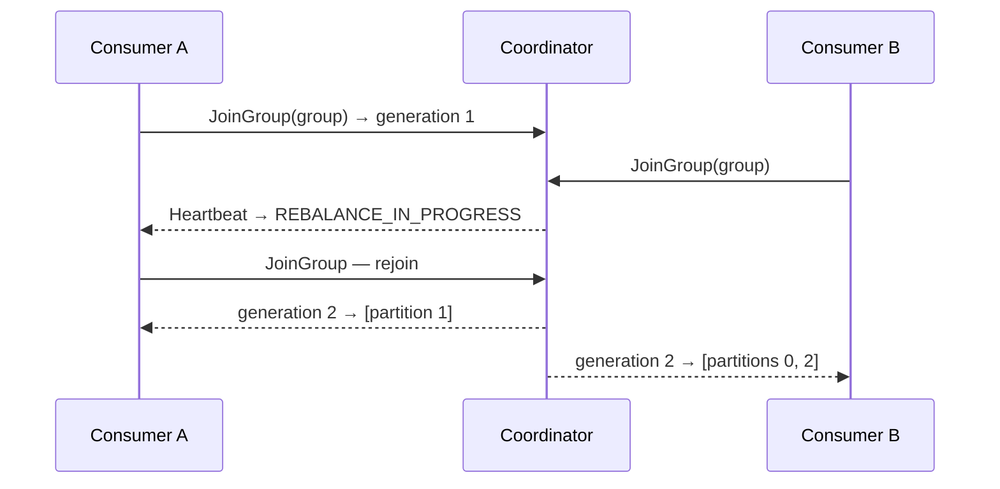

# mini-kafka

A distributed, replicated, Kafka-like message broker built **from scratch in Java** — no Kafka, no messaging libraries, and **zero runtime dependencies**. It uses only the JDK: TCP sockets, NIO file channels, and `java.util.concurrent`.

The project implements the core mechanisms that make Kafka *Kafka*: a binary wire protocol with correlation IDs, an append-only **segmented commit log** with a sparse offset index and CRC-checked records, partitioned topics, **leader–follower replication** with an in-sync replica set (ISR) and high-watermark for durable `acks=all`, a **from-scratch Raft consensus quorum** for controller election and automatic partition-leader failover (KRaft-style, without ZooKeeper), and **consumer groups** with automatic partition rebalancing.

> Built as a deep dive into distributed-systems fundamentals — sockets, binary protocols, disk I/O, concurrency, replication, consensus, and fault tolerance.
>
> The goal is to understand Kafka by rebuilding a faithful slice of its core mechanics, not to reimplement Kafka itself. See [Scope & Honest Limitations](#scope--honest-limitations).

---

## Contents

* [Features](#features)
* [Architecture](#architecture)
* [How the Commit Log Works](#how-the-commit-log-works)
* [How Replication Works](#how-replication-works)
* [Automatic Failover — Raft Controller](#automatic-failover--raft-controller)
* [Consumer Groups & Rebalancing](#consumer-groups--rebalancing)
* [The Wire Protocol](#the-wire-protocol)
* [Quick Start](#quick-start)
* [CLI Reference](#cli-reference)
* [Benchmark](#benchmark)
* [Tests](#tests)
* [Scope & Honest Limitations](#scope--honest-limitations)
* [What I'd Build Next](#what-id-build-next)
* [Project Layout](#project-layout)

---

## Features

* **Raw TCP server** with length-prefixed framing and a thread-per-connection model.
* **Kafka-style binary protocol**

  * Every request contains `apiKey`, `apiVersion`, and `correlationId`.
  * The broker advertises supported APIs through an `ApiVersions` handshake.
  * API keys mirror real Kafka where applicable:

    * Produce = `0`
    * Fetch = `1`
    * Metadata = `3`
    * ApiVersions = `18`
    * And others.
* **Append-only segmented commit log** per partition:

  * Segments are named by their base offset.
  * Segments roll once they exceed `log.segment.bytes`.
  * A sparse offset index provides efficient offset lookups.
  * Every record contains a CRC32 checksum.
  * Crash recovery detects and truncates torn trailing writes.
* **Partitioned topics** with a deterministic partition assignor.
* **Leader–follower replication**

  * Followers pull records from leaders, following Kafka's replication model.
  * Leaders maintain an **in-sync replica set (ISR)**.
  * A **high-watermark (HW)** determines which records are committed and visible to consumers.
  * `acks=all` waits for the record to become committed.
* **Automatic leader failover**

  * Brokers form a Raft consensus quorum.
  * The Raft leader acts as the cluster controller.
  * When a partition leader fails, the controller commits a new leader through the Raft log.
  * Brokers reconcile their roles based on the committed metadata.
  * No ZooKeeper is required.
* **Consumer groups**

  * Consumers sharing the same `group.id` divide partitions between themselves.
  * Supports `JoinGroup`, `SyncGroup`, `Heartbeat`, and `LeaveGroup`.
  * Automatic rebalancing when members join, leave, or time out.
* **Producer and consumer clients**

  * Murmur2 partitioner.
  * `ListOffsets` with earliest/latest support.
  * Durable offset commit/fetch.
  * A miniature equivalent of Kafka's `__consumer_offsets`.
* **CLI client** for producing, consuming, creating topics, and benchmarking.
* **Docker / Docker Compose** support for a 3-broker cluster.
* **JUnit test suite** covering storage, protocol, replication, Raft, failover, and consumer groups.

---

## Architecture



Each broker independently computes the same partition-to-leader/replica layout from the shared configuration using `PartitionAssignor`.

This allows the cluster to derive the initial partition layout deterministically without requiring ZooKeeper or a controller for that initial assignment.

Raft is then used for **control-plane changes**, such as partition-leader failover.

---

# How the Commit Log Works

A partition is an ordered, append-only sequence of records addressed by **offset**.

Physically, the partition is stored as a sequence of **segment files**. The newest segment is the active segment and receives new records until it reaches `log.segment.bytes`.

Example:

```text
data/broker-1/orders-0/

├── 00000000000000000000.log     # records [0, 812)
├── 00000000000000000000.index   # sparse: offset -> byte position
├── 00000000000000000812.log     # records [812, ...)
├── 00000000000000000812.index
└── highwatermark                # committed-offset checkpoint
```

Each record stored on disk contains:

```text
length | crc32 | offset | timestamp | key | value
```

### Sparse Offset Index

The index does not contain an entry for every record.

Instead, it stores periodic offset-to-byte-position mappings:

```text
offset -> file position
```

To read from offset `N`:

1. Binary-search the sparse index.
2. Find the largest indexed offset `<= N`.
3. Seek to the corresponding byte position.
4. Scan forward until reaching offset `N`.

This keeps index lookups at approximately **O(log n)** while avoiding the memory and disk overhead of indexing every record.

### CRC and Crash Recovery

Every record contains a CRC32 checksum.

During startup, the active segment is rescanned. If a record fails CRC validation, it is treated as a torn or incomplete write caused by a crash.

The log truncates at that point, recovering to the last valid record.

### LEO and High-Watermark

Two offsets are important:

* **LEO — Log End Offset:** the offset where the next record will be appended.
* **HW — High-Watermark:** the exclusive boundary of committed records.

Consumers can only read records below the HW.

For a single replica:

```text
HW ≈ LEO
```

With replication, the leader advances HW only after the required ISR replicas have caught up.

For example:

```text
Leader:   LEO = 10
Follower: LEO = 10
Follower: LEO = 10

HW = 10
```

Therefore, offsets `0..9` are committed and visible to consumers.

### Concurrency

Each partition has its own `ReadWriteLock`:

* Appends require the write lock.
* Reads use the read lock.
* Different partitions operate independently.

This allows concurrency to scale with the number of partitions.

---

# How Replication Works

Replication is **pull-based**, following Kafka's replication model.

### 1. Replica Assignment

`PartitionAssignor` deterministically assigns replicas:

```text
replica[r] = brokers[(partition + r) % brokerCount]
```

Replica `0` is initially the leader.

Because every broker computes the same assignment, the initial layout is deterministic.

### 2. Followers Fetch From the Leader

Each follower runs a `ReplicaFetcher`.

The fetcher repeatedly sends a `Fetch` request to the leader containing:

```text
replicaId = followerBrokerId
offset    = followerLEO
```

The leader returns records starting from that offset.

The follower appends the records to its local partition log and advances its own HW.

### 3. ISR Tracking

The leader tracks each follower's:

* Last fetched offset.
* Last fetch timestamp.

A follower remains in the **ISR** while it continues fetching within:

```text
replica.lag.time.max.ms
```

The ISR therefore consists of:

```text
leader + sufficiently caught-up followers
```

### 4. High-Watermark Advancement

The leader computes:

```text
HW = min(LEO of every replica in the ISR)
```

For example:

```text
Leader       LEO = 100
Follower 2   LEO = 100
Follower 3   LEO = 98

HW = 98
```

Consumers can therefore read only through offset `97`.

Once follower 3 reaches offset `100`:

```text
Leader       LEO = 100
Follower 2   LEO = 100
Follower 3   LEO = 100

HW = 100
```

Offsets `98` and `99` are now committed.

### `acks=all`

For:

```text
acks=all
```

the producer waits until the record's offset falls below the high-watermark.

This provides a meaningful durability guarantee: the record has been replicated to all currently in-sync replicas before the producer receives its acknowledgement.

### Replication Flow



---

# Automatic Failover — Raft Controller

Replication protects the **data** by keeping copies on multiple brokers.

Raft protects the **control plane** by deciding which broker should be the partition leader.

This is modeled after Kafka's modern **KRaft architecture**:

```text
Replication / ISR / HW
        ↓
      Data Plane

Raft Controller
        ↓
     Control Plane
```

### Raft Quorum

The brokers form a Raft group using a from-scratch implementation located under:

```text
com.minikafka.raft
```

The implementation includes:

* Leader election.
* Terms.
* Log replication.
* Commit tracking.
* Vote handling.
* AppendEntries RPCs.
* Persistence.
* Safety rules.
* Simulated-network tests.

The elected Raft leader acts as the **controller**.

### Partition Leader Failure

When a partition leader stops responding:

1. The controller detects the broker failure.
2. It selects a surviving replica.
3. It proposes a `LeaderAndIsr` metadata change.
4. The change is committed through the Raft log.
5. Every broker applies the same committed change.
6. The new replica becomes the partition leader.
7. Other replicas redirect their fetchers to the new leader.
8. Producers receiving `NOT_LEADER` refresh metadata and reroute.



Because the leadership decision is replicated through Raft, brokers converge on the same leadership state and avoid split-brain leadership decisions.

### Important Design Detail

Leadership only fails **away from** a dead broker.

There is currently no automatic preferred-leader election or fail-back.

A broker that previously led a partition, died, and later returns may have a log that is ahead of the new leader. Cleanly rejoining it requires follower log truncation and resynchronization.

---

# Consumer Groups & Rebalancing

Consumers using the same `group.id` cooperate to divide a topic's partitions among themselves.

Example:

```text
Topic: orders
Partitions: 0 1 2

Consumer A → partitions 0, 1
Consumer B → partition 2
```

A **group coordinator** manages the group lifecycle.

### 1. JoinGroup

A consumer sends:

```text
JoinGroup(groupId)
```

The coordinator maintains a rebalance barrier.

The barrier waits until the current members have rejoined the same generation before creating the next generation.

This prevents consumers from continuously leap-frogging each other between generations.

### 2. SyncGroup

Once the generation is established, consumers call:

```text
SyncGroup
```

The coordinator returns each member's partition assignment.

Assignment is currently performed **server-side** using round-robin assignment over sorted member IDs.

### 3. Heartbeat

Consumers periodically send:

```text
Heartbeat
```

If a member fails to heartbeat within the configured session timeout:

1. The coordinator removes the member.
2. A new rebalance begins.
3. Remaining consumers rejoin.
4. A new generation is created.
5. Partitions are reassigned.



> **Note:** Kafka normally ships a client-side partition assignor through the JoinGroup/SyncGroup protocol. This implementation intentionally uses a server-side round-robin assignor.
>
> The group coordinator and its offsets also currently live on a single broker rather than being replicated.

---

# The Wire Protocol

Every request and response uses a length-prefixed binary frame.

### Request

```text
Request =
    size
    apiKey
    apiVersion
    correlationId
    clientId
    body
```

More precisely:

```text
INT32 size
INT16 apiKey
INT16 apiVersion
INT32 correlationId
STRING clientId
body
```

### Response

```text
Response =
    size
    correlationId
    body
```

All fixed-width integers are **big-endian**.

### Primitive Types

```text
STRING
    INT16 length
    UTF-8 bytes

BYTES
    INT32 length
    bytes

    -1 length = null

ARRAY
    INT32 count
    elements
```

### Implemented APIs

The broker currently implements:

```text
ApiVersions
Metadata
CreateTopics
Produce
Fetch
ListOffsets
OffsetCommit
OffsetFetch
JoinGroup
SyncGroup
Heartbeat
LeaveGroup
```

It also supports two internal broker-to-broker API keys for the Raft controller quorum:

```text
RaftRequestVote
RaftAppendEntries
```

These use the same length-prefixed framing mechanism.

### Dual-Purpose Fetch API

The same `Fetch` API is used for both:

**Consumers**

```text
replicaId = -1
```

Reads are capped at the high-watermark.

**Followers**

```text
replicaId >= 0
```

Followers can fetch up to the leader's LEO.

This mirrors Kafka's dual-purpose Fetch design.

---

# Quick Start

## Requirements

* **JDK 17+**
* **Maven**
* Docker is optional.

### Build

```bash
mvn -q -DskipTests package
```

This produces:

```text
target/mini-kafka.jar
```

---

## Run a Single Broker

```bash
java -jar target/mini-kafka.jar broker config/broker-single.properties
```

In another terminal:

```bash
java -jar target/mini-kafka.jar produce \
  --bootstrap localhost:9092 \
  --topic demo
```

Consume the records:

```bash
java -jar target/mini-kafka.jar consume \
  --bootstrap localhost:9092 \
  --topic demo \
  --from-beginning
```

---

# Run a Local 3-Broker Cluster

Start the cluster:

```bash
scripts/run-local-cluster.sh
```

The brokers run on:

```text
9092
9093
9094
```

Produce:

```bash
java -jar target/mini-kafka.jar produce \
  --bootstrap localhost:9092 \
  --topic orders
```

Consume from another broker:

```bash
java -jar target/mini-kafka.jar consume \
  --bootstrap localhost:9093 \
  --topic orders \
  --from-beginning
```

Stop the cluster:

```bash
scripts/stop-local-cluster.sh
```

---

# Docker Cluster

Start the cluster:

```bash
docker compose up --build
```

Run a consumer inside the Compose network:

```bash
docker compose run --rm mk-broker-1 \
  consume \
  --bootstrap mk-broker-1:9092 \
  --topic orders \
  --from-beginning
```

A Makefile is also provided:

```bash
make package
make cluster-up
make bench
make test
```

---

# CLI Reference

| Command                                                                   | Purpose                     |
| ------------------------------------------------------------------------- | --------------------------- |
| `broker <config.properties>`                                              | Start a broker              |
| `create-topic --bootstrap … --topic … [--partitions N] [--replication R]` | Create a topic              |
| `produce --bootstrap … --topic … [--acks 1] [--key-separator :]`          | Send stdin lines as records |
| `consume --bootstrap … --topic … [--group G] [--from-beginning]`          | Consume records             |
| `bench --bootstrap … [--records N] [--size B] [--create]`                 | Run a throughput benchmark  |

---

# Benchmark

Run:

```bash
java -jar target/mini-kafka.jar bench \
  --bootstrap localhost:9092 \
  --topic bench \
  --create \
  --partitions 3 \
  --replication 3 \
  --records 200000 \
  --size 100
```

The benchmark reports:

* Synchronous produce throughput.
* Consume throughput.
* Total elapsed time.
* Messages per second.
* MB per second.

Produce throughput is intentionally measured end-to-end: each send waits for the broker acknowledgement over a single connection.

Example output:

```text
PRODUCE 200,000 msgs in X.Xs
=> NN,NNN msgs/sec
=> NN.N MB/sec
```

> Replace the example values with measurements from your own machine.

---

# Tests

Run the complete test suite:

```bash
mvn test
```

The tests cover:

### Protocol

* Request serialization.
* Response serialization.
* Round-trip encoding/decoding.

### Storage

* Sparse offset index.
* CRC validation.
* Corruption detection.
* Crash recovery.
* Segment rolling.

### Partitioning

* Deterministic partition assignment.

### Raft

* Leader election.
* Log replication.
* Controller failover.
* Simulated network behavior.

Relevant tests include:

```text
RaftElectionTest
RaftReplicationTest
```

### Consumer Groups

```text
GroupCoordinatorTest
ConsumerGroupRebalanceTest
```

### End-to-End

* Produce → consume.
* Real 3-broker leader failover.
* `acks=all` durability during leader failure.

The failover test:

```text
ControllerFailoverTest
```

kills a partition leader and verifies that committed `acks=all` data is not lost.

---

# Scope & Honest Limitations

This project is intentionally built to be **understood and defended**, rather than to replace production Kafka.

The following trade-offs are deliberate.

### 1. No Preferred-Leader Failback

Leadership automatically moves away from a failed broker.

However, when the original broker returns, leadership does not automatically move back.

There is currently no preferred-leader election.

### 2. Recovered Old Leaders Need Log Truncation

After a failover, an old leader may return with a log that is ahead of the new leader.

For example:

```text
Old Leader:
0 1 2 3 4 5 6

New Leader:
0 1 2 3 4 5
```

The recovered broker needs to truncate its divergent tail and resynchronize from the current leader.

The concept is understood and designed, but the complete follower truncation/rejoin workflow is not yet wired into the cluster.

Failover to a surviving replica — the common case — is fully handled and tested.

### 3. Server-Side Consumer Assignment

Consumer group assignment currently uses one strategy:

```text
server-side round-robin
```

Kafka supports pluggable client-side assignors such as range, sticky, and cooperative strategies.

That flexibility is intentionally out of scope.

### 4. Single-Broker Group Coordinator

A consumer group's coordinator and committed offsets live on one broker.

They are not currently replicated.

If that broker goes down:

* The group cannot make progress.
* The consumer treats the offsets as unavailable.
* The consumer falls back to its configured offset reset policy.

A fault-tolerant coordinator and replicated offset storage are future work.

### 5. Simplified Fetch Path

The implementation currently has:

* One record per fetch batch on the wire.
* No compression.
* Polling-based replica fetches.
* No long-poll/fetch purgatory.

The implementation is focused on correctness and understanding rather than maximum throughput.

### 6. No Security or Advanced Log Management

The project currently does not implement:

* Authentication.
* TLS.
* Quotas.
* Log retention.
* Log compaction.

These features are intentionally outside the core distributed-systems scope.

---

# What I'd Build Next

### 1. Recovered Leader Resynchronization

* Implement follower log truncation.
* Detect divergent tails.
* Re-sync recovered brokers.
* Add preferred-leader election.

### 2. Improve Throughput

* Record batching.
* Compression.
* Long-poll fetch / fetch purgatory.
* More efficient network handling.

### 3. Fault-Tolerant Consumer Groups

* Implement log retention.
* Implement log compaction.
* Build a real replicated `__consumer_offsets` topic.
* Replicate group coordinator state.
* Support coordinator failover.

### 4. Improve Connection Scalability

Replace the thread-per-connection model with either:

* An NIO selector/reactor architecture.
* Java virtual threads.

### 5. Pluggable Consumer Assignors

Support:

* Range.
* Round-robin.
* Sticky.
* Potentially cooperative rebalancing.

Assignment strategies could then be negotiated through `JoinGroup` / `SyncGroup`.

---

# Project Layout

```text
src/main/java/com/minikafka/

├── common/
│   ├── API keys
│   ├── error codes
│   ├── Murmur2 partitioner
│   ├── Node
│   ├── TopicPartition
│   └── logger
│
├── protocol/
│   ├── wire codec
│   ├── ByteWriter
│   ├── Protocol
│   └── request/response messages
│
├── storage/
│   ├── Record
│   ├── OffsetIndex
│   ├── LogSegment
│   ├── Log
│   └── LogManager
│
├── network/
│   ├── KafkaServer
│   └── ConnectionHandler
│
├── raft/
│   ├── RaftNode
│   ├── log entries
│   ├── RPCs
│   ├── persistence
│   └── transport
│
├── broker/
│   ├── BrokerConfig
│   ├── Cluster
│   ├── PartitionAssignor
│   ├── RequestHandler
│   ├── OffsetManager
│   ├── Broker
│   ├── Controller
│   ├── MetadataStateMachine
│   ├── SocketRaftTransport
│   └── GroupCoordinator
│
├── replication/
│   ├── ReplicaManager
│   └── ReplicaFetcher
│
├── client/
│   ├── BrokerConnection
│   ├── KafkaClient
│   ├── Producer
│   ├── Consumer
│   └── CLI
│
└── metrics/
    └── lightweight counters
```

---

## Design Summary

At a high level, the project separates the system into two major planes:

```text
                    mini-kafka
                        │
          ┌─────────────┴─────────────┐
          │                           │
      Data Plane                 Control Plane
          │                           │
   Partition Logs                Raft Quorum
   Replication                    Controller
   ISR                            Metadata
   High-Watermark                 Leader Election
   Produce / Fetch                Failover
          │                           │
          └─────────────┬─────────────┘
                        │
                 Fault-Tolerant
                 Message Broker
```

The key distributed-systems ideas demonstrated by the project are:

```text
TCP networking
      ↓
Binary protocol
      ↓
Append-only storage
      ↓
Partitioning
      ↓
Replication
      ↓
ISR + High-Watermark
      ↓
Durable acknowledgements
      ↓
Raft consensus
      ↓
Automatic leader failover
      ↓
Consumer-group coordination
      ↓
Rebalancing
```

The result is a compact Kafka-like broker designed to demonstrate **how the major pieces of a distributed log system fit together**, while keeping the implementation small enough to understand, test, and defend.
